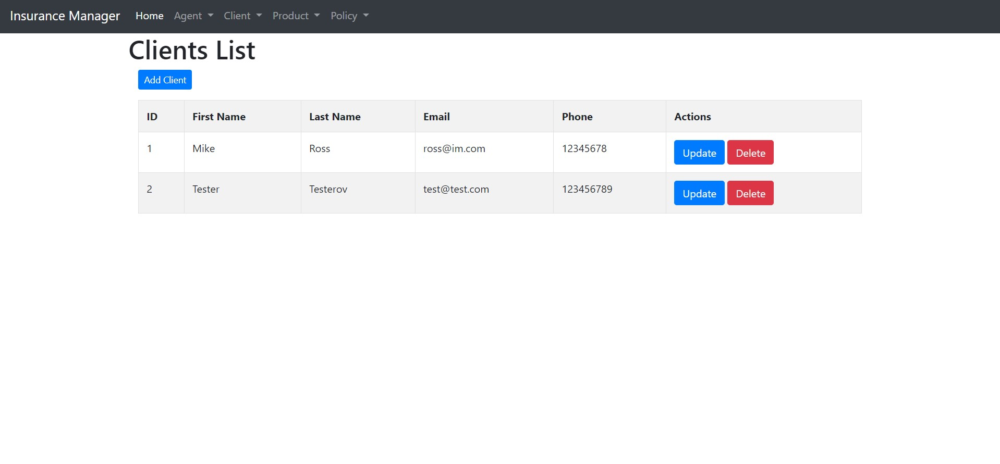
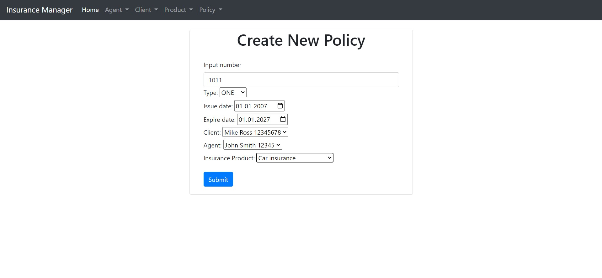
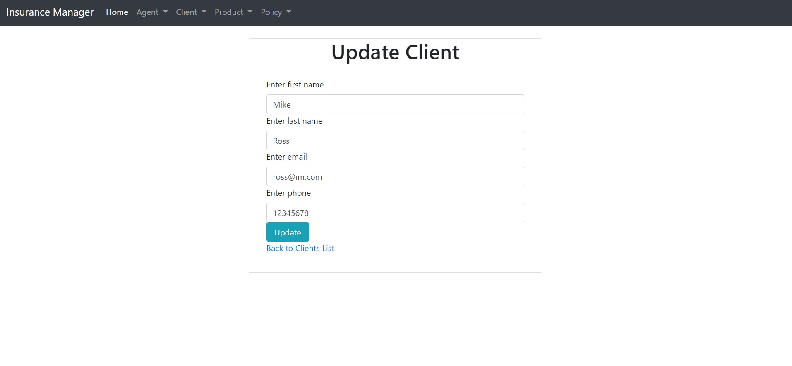

# Spring Boot MVC Insurance Manager Application
## Installation & Usage

```bash
$ git clone https://github.com/vlad777442/spring-boot-mvc-insurance-app
```
Configure application.properties

Soon...

[http://localhost:8080/](http://localhost:8080/)

TODO:
* Validation;
* Exceptions.





